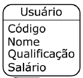

# persistencia_dados_trabalho

**Trabalho de Persistência de dados (semestre 2018.1)**
-------------
Software que *adicina, remove, altera e consulta* registros em arquivo por *QUALQUER ATRIBUTO*. o arquivo segue um HASH base 28.

#####Cenário

#####Considerações
- O atributo chave de usuário deve ser código
- O código deve ser informado pelo usuário
- A exclusão de registros será lógica
- Deve existir uma funcionalidade que permita ver a posição do registro no arquivo, a posição no hash e os dados do atributo
	> Exemplo:
	>Hash 0: [posição no arquivo,<Registro7>],[posição no arquivo,<Registro10>],[posição no arquivo,<Registro3>]
	>Hash 1: [posição no arquivo,<Registro4>],[posição no arquivo,<Registro11>]
	>...
	>Hash N: [posição no arquivo,<RegistroN-1>],[posição no arquivo,<Registro 2>]
- Os dados do arquivo serão armazenados na forma binária e serão acessados de forma aleatória (RandomAccessFile).	
